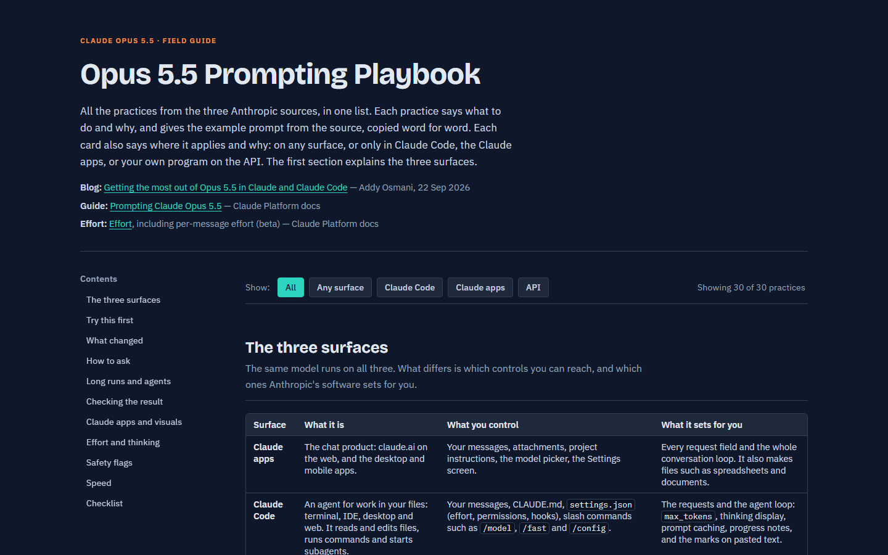

# Opus 5.5 playbook

This repository holds two things:

1. **`opus55-kit`** — a Claude Code plugin. It applies the Anthropic best practices for Claude Opus 5.5
   in your sessions, so you do not have to remember them.
2. **`opus-5-5-playbook.html`** — a one-page reference. It lists 30 practices from the sources, with the
   source prompts copied word for word, and says for each one where it applies: Claude Code, the Claude
   apps, or the API.

The repository is also a plugin marketplace (`.claude-plugin/marketplace.json`, name `opus55-local`).

## The playbook page

Open the live page: **[Opus 5.5 Prompting Playbook](https://az9713.github.io/opus-5.5-playbook/opus-5-5-playbook.html)** (GitHub Pages).
Click the image to open it.

[](https://az9713.github.io/opus-5.5-playbook/opus-5-5-playbook.html)

## Sources

All rules and prompts come from three Anthropic pages (also listed in `README.txt`):

- Blog: [Getting the most out of Opus 5.5 in Claude and Claude Code](https://claude.dev/blog/getting-the-most-out-of-opus-5-5/) (2026-09-22)
- Guide: [Prompting Claude Opus 5.5](https://platform.claude.com/docs/en/build-with-claude/prompt-engineering/prompting-claude-opus-5-5)
- Docs: [Effort](https://platform.claude.com/docs/en/build-with-claude/effort#change-effort-mid-conversation-beta), including "Change effort mid-conversation" (beta)

The plugin does not add advice of its own. Each rule restates a practice from these pages.

## Install

Requires Claude Code and Python 3 on PATH (`python3` or `python`). The hooks use the standard library only.

```
claude plugin marketplace add az9713/opus-5.5-playbook
claude plugin install opus55-kit@opus55-local
```

To try it for one session without installing:

```
claude --plugin-dir /path/to/opus55-kit
```

To see the playbook page, open the [live page](https://az9713.github.io/opus-5.5-playbook/opus-5-5-playbook.html), or open `opus-5-5-playbook.html` in a browser.

## What the plugin does

| Part | When it acts | What it does |
|---|---|---|
| Standing rules (`hooks/rules.md`) | On the first prompt of a session, and again after each compaction. Only when the model is Opus 5.5. | Adds 12 rules to the context: when to stop and ask, state a finish line, end with "Blocked on me / Changed / Found", keep a `TASKS.md` checklist, check subagent evidence, the merge-blocker review format, mark what you could not confirm, find contradictions in documents, the frontend avoid list, explore connected apps first, explain a choice in a few sentences, and what to do after a safety flag. |
| Prompt nudges (`hooks/opus55.py prompt`) | When a prompt has one of 3 habits. Only on Opus 5.5. | Shows one line for: "think carefully" / "think step by step", "show your reasoning" (can trigger the `reasoning_extraction` safety flag), or a long build/migrate/refactor prompt with no finish line. |
| TASKS.md continuation (`hooks/opus55.py stop`) | When a turn ends. Only on Opus 5.5, and only in unattended runs (`CLAUDE_CODE_SESSION_ATTENDED=0`, which `claude -p` and the SDK set). | If the session used `TASKS.md` and the file still has unticked `- [ ]` items, it sends the model back once to finish them. |
| `opus55-audit` skill | When you ask "audit my setup for Opus 5.5". | Finds think lines, reasoning requests and "thinking disabled" in your saved instructions. Checks the effort setting and the permission-prompt settings. Changes a file only after you approve. |

### How the plugin finds the model

A hook's input does not include the model. The plugin reads the model of the last reply in the
session transcript. Before the first reply, it reads the `--model` flag of the `claude` process. If it
still cannot tell, it treats the model as Opus 5.5. The first line of `rules.md` tells any other model
to ignore the rules, so a wrong guess costs context tokens but does not change behavior.

## How the plugin was made

The plugin came out of one Claude Code session on Opus 5.5 (2026-09-23 to 2026-09-24). The steps:

1. **Read the sources and sort the practices.** Claude read the 3 pages and listed 17 practices. For
   each one it proposed a place: a standing instruction, a hook, a skill, a setting, or a habit that
   only the user can keep.
2. **Build it into one personal setup.** The first version went into the author's own `~/.claude`:
   a section in `CLAUDE.md`, a Stop hook for `TASKS.md`, 3 prompt-check rules in a local "coach" hook,
   and `modelSettings["claude-opus-5-5"] = {"effortLevel": "medium"}` in `settings.json`.
3. **Condition on the model.** A `CLAUDE.md` section loads for every model and depends on the model
   obeying a label. So the rules moved to a file that a `UserPromptSubmit` hook adds only when the
   model is Opus 5.5.
4. **Limit the Stop hook to unattended runs.** The author runs interactive sessions in
   bypass-permissions mode, so the permission mode could not tell attended from unattended. The
   environment variable `CLAUDE_CODE_SESSION_ATTENDED` could: it was measured as `0` in `claude -p` and
   `1` in an interactive session.
5. **Write the playbook page.** A 30-card HTML page with the source prompts and a "where it applies"
   line on each card.
6. **Ask how a user adopts the practices without memorizing them.** The answer ranked 5 places for a
   practice: the model does it; set it once; remind at the moment of the mistake; load it when the task
   matches; show it when a rare event happens. Two user habits became model rules here: "state the
   finish line" and the "Blocked on me / Changed / Found" summary.
7. **Package it as a plugin.** The rules, the nudges, the Stop hook and a new audit skill went into
   `opus55-kit`, with one Python script for both hooks. `claude plugin validate` passed. The author then
   removed the personal copies (to prevent every rule and nudge from running twice) and installed the
   plugin from a local marketplace.

**Tests.** Real `claude -p` runs with only the plugin loaded:

| Test | Result |
|---|---|
| Opus 5.5 | The rules were in the context, and the "think step by step" nudge appeared. |
| Sonnet 5 | No rules and no nudge. The plugin found the model from the `--model` flag. |
| TASKS.md on Opus 5.5, unattended | The model ended with a report. The hook sent it back, and it did the open item and ticked it. |
| Old TASKS.md not used in the session | Ignored. |
| Installed copy (from the marketplace) | The rules were in the context. |

**Not tested:** the `opus55-audit` skill has not run on a real setup yet.

## What is in the plugin, and why

Each row links to the source section it comes from. Blog = the Opus 5.5 blog, Guide = "Prompting Claude
Opus 5.5", Effort = the "Effort" docs page (see [Sources](#sources)). The last column links to
the matching card on the [playbook page](#the-playbook-page).

**Standing rules (`rules.md`).** These are the model's work, not the user's. Standing instructions let the
user write them zero times.

| Rule | Source section | Playbook card |
|---|---|---|
| When to stop and ask; keep going otherwise | Blog: [Tell it which stops you want][b-stops] | [Tell it which stops you want][p-tell-it-which-stops-you-want] |
| State a finish line when the task has none | Blog: [Say what "done" looks like, then let it run][b-done] | [Say what "done" looks like, then let it run][p-say-what-done-looks-like-then-let-it-run] |
| Run summary: Blocked on me / Changed / Found | Blog: [Read what it needs from you first][b-needs] | [Read what it needs from you first][p-read-what-it-needs-from-you-first] |
| Keep a `TASKS.md` checklist | Blog: [Keep the task list in a file][b-tasks] | [Keep the task list in a file][p-keep-the-task-list-in-a-file] |
| Split big work across subagents; check their evidence | Blog: [Ask it to split big work across subagents][b-sub] | [Split big work across subagents][p-split-big-work-across-subagents] |
| Code review: only merge blockers, with file, line and a failing case | Blog: [Ask it to review the code][b-review] | [Ask it to review the code][p-ask-it-to-review-the-code] |
| Mark what you could not confirm, and where you looked | Blog: [Ask it to mark what it couldn't confirm][b-confirm] | [Ask it to mark what it could not confirm][p-ask-it-to-mark-what-it-could-not-confirm] |
| Find contradictions in a document: numbers, dates, names | Blog: [Ask it to check a long document][b-doc] | [Ask it to check a long document][p-ask-it-to-check-a-long-document] |
| Frontend avoid list | Blog: [For design work, name the styles you don't want][b-design]; Guide: [Frontend design defaults][g-front] | [For design work, name the styles you do not want][p-for-design-work-name-the-styles-you-do-not-want] |
| Explore connected apps before changing anything | Guide: [Explore context in multi-app workflows][g-explore] | [Explore context in multi-app workflows][p-explore-context-in-multi-app-workflows] |
| Explain a choice in a few sentences, not the internal reasoning | Blog: [Don't ask it to show its reasoning in the reply][b-reason]; Guide: [Safeguard refusals][g-refusal] | [Do not ask it to show its reasoning in the reply][p-do-not-ask-it-to-show-its-reasoning-in-the-reply] |
| Recovery after a safety flag (`/model`, Esc Esc, `/config`, `/feedback`), marked "applies to any model". The flag is rare, so the user will not remember the steps. | Blog: [In Claude Code][b-flag-cc]; [In Claude apps][b-flag-apps] | [In Claude Code][p-in-claude-code]; [In Claude apps][p-in-claude-apps] |

**Prompt nudges.** Only the user can change what they type. A one-line note at the moment of the habit is
the only automatic reminder possible.

| Nudge | Source section | Playbook card |
|---|---|---|
| Delete "think carefully" / "think step by step" | Blog: [Stop telling it to "think hard"][b-think]; Guide: [Thinking instructions in chat system prompts][g-think] | [Delete "think hard" instructions][p-delete-think-hard-instructions] |
| Do not ask to "show your reasoning" | Blog: [Don't ask it to show its reasoning in the reply][b-reason]; Guide: [Safeguard refusals][g-refusal] | [Do not ask it to show its reasoning in the reply][p-do-not-ask-it-to-show-its-reasoning-in-the-reply] |
| Give a big task a finish line | Blog: [Say what "done" looks like, then let it run][b-done] | [Say what "done" looks like, then let it run][p-say-what-done-looks-like-then-let-it-run] |

**Stop hook.** This must happen with no one watching, and the model cannot remind itself after its turn ends.

| Behavior | Source section | Playbook card |
|---|---|---|
| Send an unattended run back to open `TASKS.md` items | Blog: [Keep the task list in a file][b-tasks]; Guide: [Unattended agentic runs][g-unattended] | [Keep the task list in a file][p-keep-the-task-list-in-a-file]; [Unattended runs: a text-only end of turn is a report, not "done"][p-unattended-runs-a-text-only-end-of-turn-is-a-report-not-done] |

**Audit skill.** These are one-time fixes. After one audit, no one needs to remember them.

| Check | Source section | Playbook card |
|---|---|---|
| Delete think lines from saved instructions | Blog: [Stop telling it to "think hard"][b-think]; Guide: [Thinking instructions in chat system prompts][g-think] | [Delete "think hard" instructions][p-delete-think-hard-instructions] |
| Find requests to show reasoning | Guide: [Safeguard refusals][g-refusal] | [Do not ask it to show its reasoning in the reply][p-do-not-ask-it-to-show-its-reasoning-in-the-reply] |
| Find "thinking disabled" (400 error on Opus 5.5) | Guide: [Prompts written for thinking disabled][g-disabled] | [Migrate prompts written for thinking disabled][p-migrate-prompts-written-for-thinking-disabled] |
| Set effort to `medium` explicitly | Guide: [Calibrate effort][g-effort]; Effort: [Recommended effort levels for Claude Opus 5.5][e-rec] | [Start at medium, set it explicitly, and measure][p-start-at-medium-set-it-explicitly-and-measure] |
| Keep permission prompts for destructive commands | Blog: [Tell it which stops you want][b-stops] | [Tell it which stops you want][p-tell-it-which-stops-you-want] |

## What is not in the plugin, and why

| Practice | Why not | Source section | Playbook card |
|---|---|---|---|
| "Treat an earlier answer as done" | The guide says it makes the model less likely to point out a mistake in an earlier answer. The plugin README gives it as an opt-in line for long chats. | Blog: [In a project, say when answers are settled][b-settled]; Guide: [Thinking instructions in chat system prompts][g-think] | [In a long chat, say when answers are settled][p-in-a-long-chat-say-when-answers-are-settled] |
| The long system-prompt paragraph for unattended runs | The guide says to leave it out of work where a person is present. The 2-sentence stop rule from the blog is used instead. | Guide: [Unattended agentic runs][g-unattended] | [Unattended runs: a text-only end of turn is a report, not "done"][p-unattended-runs-a-text-only-end-of-turn-is-a-report-not-done] |
| 2–3 automatic continues | The Stop hook sends the model back once in a row (the built-in `stop_hook_active` flag). A counter would add state. Add it only if one continue is too few. | Guide: [Unattended agentic runs][g-unattended] | [Unattended runs: a text-only end of turn is a report, not "done"][p-unattended-runs-a-text-only-end-of-turn-is-a-report-not-done] |
| `max_tokens` 128,000 | API only. Claude Code sets it. | Guide: [Calibrate effort][g-effort] | [Set max_tokens high enough][p-set-max-tokens-high-enough] |
| `thinking.display: "updates"`, a reminder after 5 silent steps | API only. Claude Code shows progress notes itself. | Guide: [User-facing progress updates][g-progress] | [User-facing progress updates: four controls][p-user-facing-progress-updates-four-controls] |
| Per-message effort (beta header `mid-conversation-output-config-2026-07-01`) | API only. | Effort: [Per-message effort (beta)][e-mid]; [Best practices][e-best] | [Change effort mid-conversation without losing the cache][p-change-effort-mid-conversation-without-losing-the-cache] |
| Time budgets such as `elapsed 340s / 1200s` | API only, for your own multiagent harness. | Guide: [Time signals for multiagent harnesses][g-time] | [Time signals for multiagent harnesses][p-time-signals-for-multiagent-harnesses] |
| Refusal fallback | API only. | Guide: [Safeguard refusals][g-refusal] | [What the safeguards cover][p-what-the-safeguards-cover] |
| Marking pasted text | Claude Code already wraps pasted text in `<pasted_content>` tags. | Guide: [Mark pasted text in user messages][g-pasted] | [Mark pasted text in user messages][p-mark-pasted-text-in-user-messages] |
| Claude apps (claude.ai, desktop, mobile) | Plugins do not run there. `opus55-kit/README.md` has a text to paste into a project's instructions. | Blog: [4. In Claude apps][b-apps] | [Claude apps and visuals (section)][p-apps] |
| Attach the image instead of retyping it | A hook needs a word in the prompt or an event to react to. This habit has neither. The playbook page covers it. | Blog: [Share the chart or screenshot itself][b-chart]; Guide: [Tools for complex visual inputs][g-visual] | [Share the chart or screenshot itself][p-share-the-chart-or-screenshot-itself]; [Tools for the densest visual inputs][p-tools-for-the-densest-visual-inputs] |
| `/fast` for back-and-forth work | Same: no trigger. | Blog: [Turn on fast mode when you're waiting on each reply][b-fast] | [Turn on fast mode when you wait on each reply][p-turn-on-fast-mode-when-you-wait-on-each-reply] |
| Add details while the model works | Same: no trigger. | Blog: [Add to a running task][b-add] | [Add to a running task][p-add-to-a-running-task] |
| Ask for the finished file | Same: no trigger. | Blog: [Ask for the finished file][b-file] | [Ask for the finished file][p-ask-for-the-finished-file] |
| Separate skills for review, document checks and subagent audits | A skill edit applies to every model. These rules had to apply to Opus 5.5 only, so they went into the gated rules file. The cost: about 600 tokens of context in each Opus 5.5 session. | Blog: [Ask it to review the code][b-review]; [Ask it to check a long document][b-doc]; [Ask it to split big work across subagents][b-sub] | [Ask it to review the code][p-ask-it-to-review-the-code]; [Ask it to check a long document][p-ask-it-to-check-a-long-document]; [Split big work across subagents][p-split-big-work-across-subagents] |

## Known limits

- On a first prompt without `--model`, the plugin assumes Opus 5.5.
- A `/model` switch during a session does not remove rules that were already added. The first line of
  `rules.md` tells the new model to ignore them, except the safety-flag rule.
- A `/loop` in an interactive session counts as attended, so the Stop hook does not run there.
- While a used `TASKS.md` has open items in an unattended run, the Stop hook acts on every turn, not
  once per session. Tick the items or delete the file to stop it.

## Layout

```
.claude-plugin/marketplace.json   marketplace "opus55-local"
opus55-kit/                       the plugin (see opus55-kit/README.md)
  .claude-plugin/plugin.json
  hooks/hooks.json                UserPromptSubmit + Stop
  hooks/opus55.py                 both hooks, stdlib only, exits 0 on any error
  hooks/rules.md                  the 12 standing rules
  skills/opus55-audit/SKILL.md    one-time setup audit
opus-5-5-playbook.html            30-practice reference page (served by GitHub Pages)
playbook.png                      screenshot of the page for this README
README.txt                        the 3 source URLs
```

## License

MIT (see `opus55-kit/.claude-plugin/plugin.json`).

[b-stops]: https://claude.dev/blog/getting-the-most-out-of-opus-5-5/#tell-it-which-stops-you-want
[b-done]: https://claude.dev/blog/getting-the-most-out-of-opus-5-5/#say-what-done-looks-like-then-let-it-run
[b-needs]: https://claude.dev/blog/getting-the-most-out-of-opus-5-5/#read-what-it-needs-from-you-first
[b-tasks]: https://claude.dev/blog/getting-the-most-out-of-opus-5-5/#keep-the-task-list-in-a-file
[b-sub]: https://claude.dev/blog/getting-the-most-out-of-opus-5-5/#ask-it-to-split-big-work-across-subagents
[b-review]: https://claude.dev/blog/getting-the-most-out-of-opus-5-5/#ask-it-to-review-the-code
[b-confirm]: https://claude.dev/blog/getting-the-most-out-of-opus-5-5/#ask-it-to-mark-what-it-couldnt-confirm
[b-doc]: https://claude.dev/blog/getting-the-most-out-of-opus-5-5/#ask-it-to-check-a-long-document
[b-design]: https://claude.dev/blog/getting-the-most-out-of-opus-5-5/#for-design-work-name-the-styles-you-dont-want
[b-reason]: https://claude.dev/blog/getting-the-most-out-of-opus-5-5/#dont-ask-it-to-show-its-reasoning-in-the-reply
[b-flag-cc]: https://claude.dev/blog/getting-the-most-out-of-opus-5-5/#in-claude-code
[b-flag-apps]: https://claude.dev/blog/getting-the-most-out-of-opus-5-5/#in-claude-apps
[b-think]: https://claude.dev/blog/getting-the-most-out-of-opus-5-5/#stop-telling-it-to-think-hard
[b-settled]: https://claude.dev/blog/getting-the-most-out-of-opus-5-5/#in-a-project-say-when-answers-are-settled
[b-apps]: https://claude.dev/blog/getting-the-most-out-of-opus-5-5/#4-in-claude-apps
[b-chart]: https://claude.dev/blog/getting-the-most-out-of-opus-5-5/#share-the-chart-or-screenshot-itself
[b-fast]: https://claude.dev/blog/getting-the-most-out-of-opus-5-5/#turn-on-fast-mode-when-youre-waiting-on-each-reply
[b-add]: https://claude.dev/blog/getting-the-most-out-of-opus-5-5/#add-to-a-running-task
[b-file]: https://claude.dev/blog/getting-the-most-out-of-opus-5-5/#ask-for-the-finished-file
[g-front]: https://platform.claude.com/docs/en/build-with-claude/prompt-engineering/prompting-claude-opus-5-5#frontend-design-defaults
[g-explore]: https://platform.claude.com/docs/en/build-with-claude/prompt-engineering/prompting-claude-opus-5-5#explore-context-in-multi-app-workflows
[g-refusal]: https://platform.claude.com/docs/en/build-with-claude/prompt-engineering/prompting-claude-opus-5-5#safeguard-refusals
[g-think]: https://platform.claude.com/docs/en/build-with-claude/prompt-engineering/prompting-claude-opus-5-5#thinking-instructions-in-chat-system-prompts
[g-unattended]: https://platform.claude.com/docs/en/build-with-claude/prompt-engineering/prompting-claude-opus-5-5#unattended-agentic-runs
[g-disabled]: https://platform.claude.com/docs/en/build-with-claude/prompt-engineering/prompting-claude-opus-5-5#prompts-written-for-thinking-disabled
[g-effort]: https://platform.claude.com/docs/en/build-with-claude/prompt-engineering/prompting-claude-opus-5-5#calibrate-effort
[g-progress]: https://platform.claude.com/docs/en/build-with-claude/prompt-engineering/prompting-claude-opus-5-5#user-facing-progress-updates
[g-time]: https://platform.claude.com/docs/en/build-with-claude/prompt-engineering/prompting-claude-opus-5-5#time-signals-for-multi-agent-harnesses
[g-pasted]: https://platform.claude.com/docs/en/build-with-claude/prompt-engineering/prompting-claude-opus-5-5#mark-pasted-text-in-user-messages
[g-visual]: https://platform.claude.com/docs/en/build-with-claude/prompt-engineering/prompting-claude-opus-5-5#tools-for-complex-visual-inputs
[e-rec]: https://platform.claude.com/docs/en/build-with-claude/effort#recommended-effort-levels-for-claude-opus-5-5
[e-mid]: https://platform.claude.com/docs/en/build-with-claude/effort#change-effort-mid-conversation-beta
[e-best]: https://platform.claude.com/docs/en/build-with-claude/effort#best-practices
[p-add-to-a-running-task]: https://az9713.github.io/opus-5.5-playbook/opus-5-5-playbook.html#add-to-a-running-task
[p-apps]: https://az9713.github.io/opus-5.5-playbook/opus-5-5-playbook.html#apps
[p-ask-for-the-finished-file]: https://az9713.github.io/opus-5.5-playbook/opus-5-5-playbook.html#ask-for-the-finished-file
[p-ask-it-to-check-a-long-document]: https://az9713.github.io/opus-5.5-playbook/opus-5-5-playbook.html#ask-it-to-check-a-long-document
[p-ask-it-to-mark-what-it-could-not-confirm]: https://az9713.github.io/opus-5.5-playbook/opus-5-5-playbook.html#ask-it-to-mark-what-it-could-not-confirm
[p-ask-it-to-review-the-code]: https://az9713.github.io/opus-5.5-playbook/opus-5-5-playbook.html#ask-it-to-review-the-code
[p-change-effort-mid-conversation-without-losing-the-cache]: https://az9713.github.io/opus-5.5-playbook/opus-5-5-playbook.html#change-effort-mid-conversation-without-losing-the-cache
[p-delete-think-hard-instructions]: https://az9713.github.io/opus-5.5-playbook/opus-5-5-playbook.html#delete-think-hard-instructions
[p-do-not-ask-it-to-show-its-reasoning-in-the-reply]: https://az9713.github.io/opus-5.5-playbook/opus-5-5-playbook.html#do-not-ask-it-to-show-its-reasoning-in-the-reply
[p-explore-context-in-multi-app-workflows]: https://az9713.github.io/opus-5.5-playbook/opus-5-5-playbook.html#explore-context-in-multi-app-workflows
[p-for-design-work-name-the-styles-you-do-not-want]: https://az9713.github.io/opus-5.5-playbook/opus-5-5-playbook.html#for-design-work-name-the-styles-you-do-not-want
[p-in-a-long-chat-say-when-answers-are-settled]: https://az9713.github.io/opus-5.5-playbook/opus-5-5-playbook.html#in-a-long-chat-say-when-answers-are-settled
[p-in-claude-apps]: https://az9713.github.io/opus-5.5-playbook/opus-5-5-playbook.html#in-claude-apps
[p-in-claude-code]: https://az9713.github.io/opus-5.5-playbook/opus-5-5-playbook.html#in-claude-code
[p-keep-the-task-list-in-a-file]: https://az9713.github.io/opus-5.5-playbook/opus-5-5-playbook.html#keep-the-task-list-in-a-file
[p-mark-pasted-text-in-user-messages]: https://az9713.github.io/opus-5.5-playbook/opus-5-5-playbook.html#mark-pasted-text-in-user-messages
[p-migrate-prompts-written-for-thinking-disabled]: https://az9713.github.io/opus-5.5-playbook/opus-5-5-playbook.html#migrate-prompts-written-for-thinking-disabled
[p-read-what-it-needs-from-you-first]: https://az9713.github.io/opus-5.5-playbook/opus-5-5-playbook.html#read-what-it-needs-from-you-first
[p-say-what-done-looks-like-then-let-it-run]: https://az9713.github.io/opus-5.5-playbook/opus-5-5-playbook.html#say-what-done-looks-like-then-let-it-run
[p-set-max-tokens-high-enough]: https://az9713.github.io/opus-5.5-playbook/opus-5-5-playbook.html#set-max-tokens-high-enough
[p-share-the-chart-or-screenshot-itself]: https://az9713.github.io/opus-5.5-playbook/opus-5-5-playbook.html#share-the-chart-or-screenshot-itself
[p-split-big-work-across-subagents]: https://az9713.github.io/opus-5.5-playbook/opus-5-5-playbook.html#split-big-work-across-subagents
[p-start-at-medium-set-it-explicitly-and-measure]: https://az9713.github.io/opus-5.5-playbook/opus-5-5-playbook.html#start-at-medium-set-it-explicitly-and-measure
[p-tell-it-which-stops-you-want]: https://az9713.github.io/opus-5.5-playbook/opus-5-5-playbook.html#tell-it-which-stops-you-want
[p-time-signals-for-multiagent-harnesses]: https://az9713.github.io/opus-5.5-playbook/opus-5-5-playbook.html#time-signals-for-multiagent-harnesses
[p-tools-for-the-densest-visual-inputs]: https://az9713.github.io/opus-5.5-playbook/opus-5-5-playbook.html#tools-for-the-densest-visual-inputs
[p-turn-on-fast-mode-when-you-wait-on-each-reply]: https://az9713.github.io/opus-5.5-playbook/opus-5-5-playbook.html#turn-on-fast-mode-when-you-wait-on-each-reply
[p-unattended-runs-a-text-only-end-of-turn-is-a-report-not-done]: https://az9713.github.io/opus-5.5-playbook/opus-5-5-playbook.html#unattended-runs-a-text-only-end-of-turn-is-a-report-not-done
[p-user-facing-progress-updates-four-controls]: https://az9713.github.io/opus-5.5-playbook/opus-5-5-playbook.html#user-facing-progress-updates-four-controls
[p-what-the-safeguards-cover]: https://az9713.github.io/opus-5.5-playbook/opus-5-5-playbook.html#what-the-safeguards-cover
